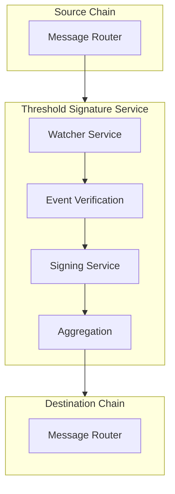
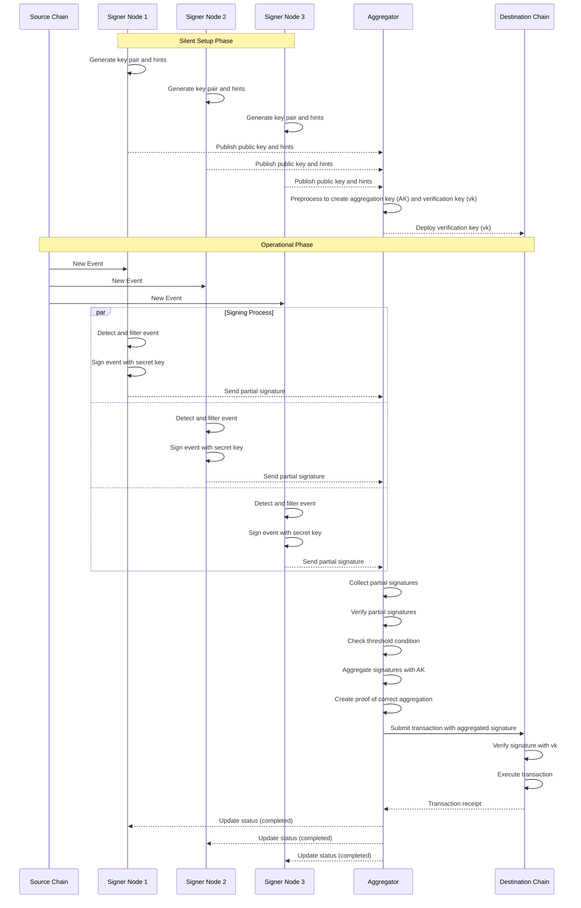

# Cross-Chain Mechanics

## Cross-Chain Mechanics

### Overview

Cross-chain mechanics are the backbone of Re²'s ability to provide secure, flexible restaking across multiple blockchain networks. Our approach focuses on creating a robust, trustless communication layer that enables validators to operate seamlessly across different blockchain environments.

### Core Components

#### 1. Message Router

The Message Router is the entry point for cross-chain communication, it acts as a gateway between source and destination chains.



**Key Responsibilities:**

* Route messages between different blockchain networks
* Manage cross-chain message formatting
* Implement security checkpoints
* Handle message serialization and deserialization

#### 2. Threshold Signature Mechanism

We use Silent BLS Threshold scheme to remove the need of DKG round to add more validators in the protocol, leveraging these signatures to provide:

* Cryptographic proof of message authenticity
* Distributed signature generation
* Minimal trust assumptions



**Signature Generation Process**

1. Validator nodes listen to events individually from the source chain.
2. Validated events are signed and shares are sent to the nominated aggregator for the round
3. All the partial signatures from validator nodes are aggregated using threshold scheme
4. Signatures are verified against group public key
5. Aggregator relays the desired message with integrity checks and signature with enough threshold on the destination chain.

### Contracts

**Re2Gateway**

The `Re2Gateway` serves as the main entry and exit point for cross-chain messages. It handles the initial sending of messages from the source chain and processes incoming messages on the destination chain.

Key responsibilities:

* Securely sending cross-chain messages
* Tracking nonces per user to prevent replay attacks
* Managing fees and value transfers
* Verifying signatures of incoming messages

**Re2MessageRouter**

The `Re2MessageRouter` is responsible for routing messages to the appropriate contract on the destination chain. It maintains a registry of authorized contracts that can participate in cross-chain messaging.

Key responsibilities:

* Routing messages to appropriate destination contracts
* Enforcing authorization controls
* Encoding and decoding message payloads
* Managing relationships with the AVS Registry and Stake Manager

**BLSVerifier**

The `BLSVerifier` provides cryptographic validation for cross-chain messages using BLS signature verification.

Key features:

* Implements BLS signature verification according to EIP-2537
* Supports single signature verification
* Validates pre-hashed messages
* Provides hash-to-G2 mapping for messages

#### Message Types

ReSquared supports various message types:

1. **AVS Messages**:
   * `ENROLL`: Enrollment of validators in an AVS
   * `ENROLL_CONFIRMED`: Confirmation of successful enrollment
   * `ENROLL_FAILED`: Notification of enrollment failure
   * `DETACH_INITIATED`: Initiation of detachment from an AVS
   * `DETACH_INITIATED_CONFIRMED`: Confirmation of detachment initiation
   * `DETACH_EXECUTE`: Execution of detachment after time lock
   * `DETACH_COMPLETED`: Confirmation of completed detachment
2. **Slashing Messages**:
   * `SLASH`: Penalty messages for validator misbehavior
3. **Reward Messages**:
   * `CLAIM_REWARD`: Messages for claiming rewards across chains

### Message Flow

#### Sending a Cross-Chain Message

1. A contract calls `Re2MessageRouter.sendMessage()` with:
   * Destination chain ID
   * Message type
   * Payload
   * Send options (gas amount, value amount, refund address)
2. `Re2MessageRouter` checks authorization and routes to `Re2Gateway`
3. `Re2Gateway.r2send()` processes the message:
   * Assigns a unique bridge ID
   * Emits a `Send` event with all required information
   * Transfers associated value to the reserve address
4. Validators observe the `Send` event and validate the message

#### Receiving a Cross-Chain Message

1. Validators submit the validated message to the `Re2Gateway` on the destination chain
2. `Re2Gateway.r2receive()` processes incoming messages:
   * Verifies the BLS signature of the message
   * Checks if the bridge ID has already been processed
   * Ensures sufficient gas for execution
3. `Re2MessageRouter.r2receiver()` receives the message:
   * Decodes the message type and payload
   * Routes to the appropriate handler based on message type
4. The target contract processes the message and performs the required action

\=======\
3\. All the partial signatures from validator nodes are aggregated using threshold cryptography\
4\. Signatures are verified against group public key\
5\. Aggregator relays the desired message with integrity checks and signature with enough threshold on the destination chain.

### Communication Workflow

#### Message Lifecycle

1. **Initiation**
   * Validator triggers a cross-chain action
   * Message encoded with necessary parameters
   * Cryptographic metadata attached
2. **Signature Aggregation**
   * Threshold number of nodes sign the message
   * Partial signatures collected
   * Group signature generated
3. **Cross-Chain Verification**
   * Destination chain validates signature
   * Verify group public key
   * Execute corresponding action

#### Message Types

* Delegation Requests
* AVS Enrollment
* Reward Claims
* Slashing Notifications
* State Synchronization

### Security Mechanisms

#### 1. Cryptographic Validation

* BLS Threshold Signatures
* Distributed key generation
* Signature verification precompiles

#### 2. Anti-Replay Protection

* Unique message identifiers
* Nonce-based message tracking
* Timestamp validation

#### 3. Economic Security

* Validator stake at risk
* Slashing conditions for malicious behavior
* Economic incentives for honest participation

### Implementation

```solidity
function sendCrossChainMessage(
    ...,
) external {    
    // Business logic to prepare message
    // ...
    // Route message to destination chain
    messageRouter.routeMessage(
        destinationChainId, 
        payload, 
        options
    );
}
```

### Advanced Features

#### Dynamic Validator Set

* Validators can join/leave cross-chain network
* Dynamic reconfiguration of threshold parameters
* Adaptive security model

#### Multi-Signature Support

* Support for multiple signature schemes
* Interoperability with different blockchain architectures
* Flexible cryptographic backends
