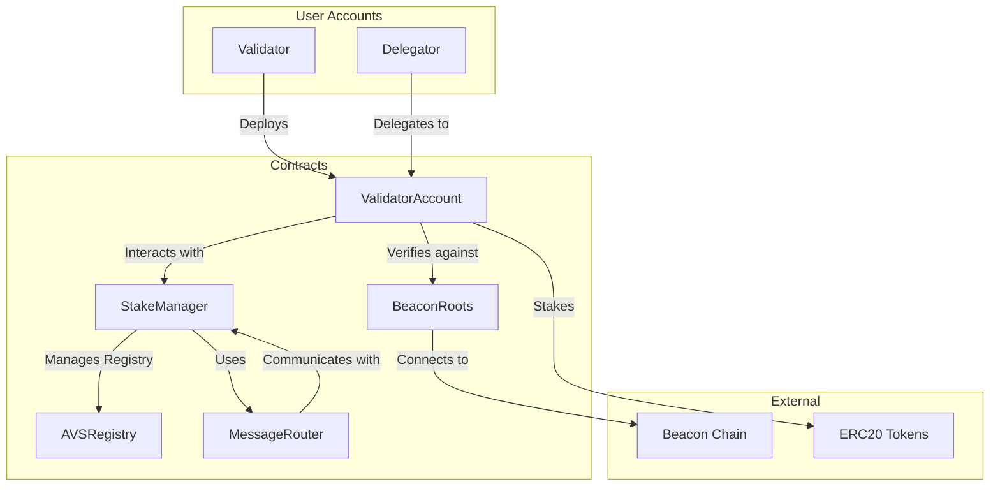
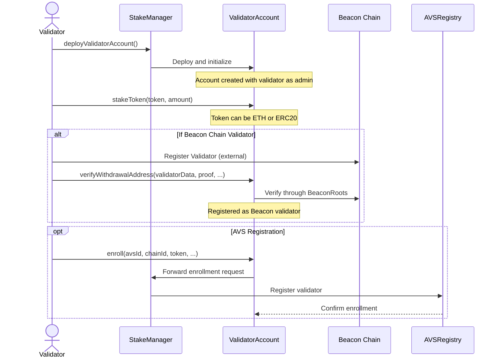
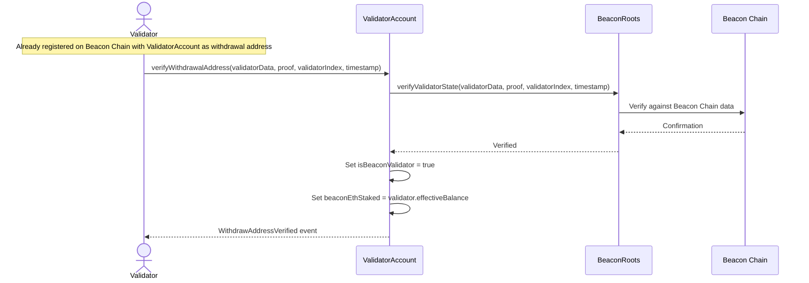
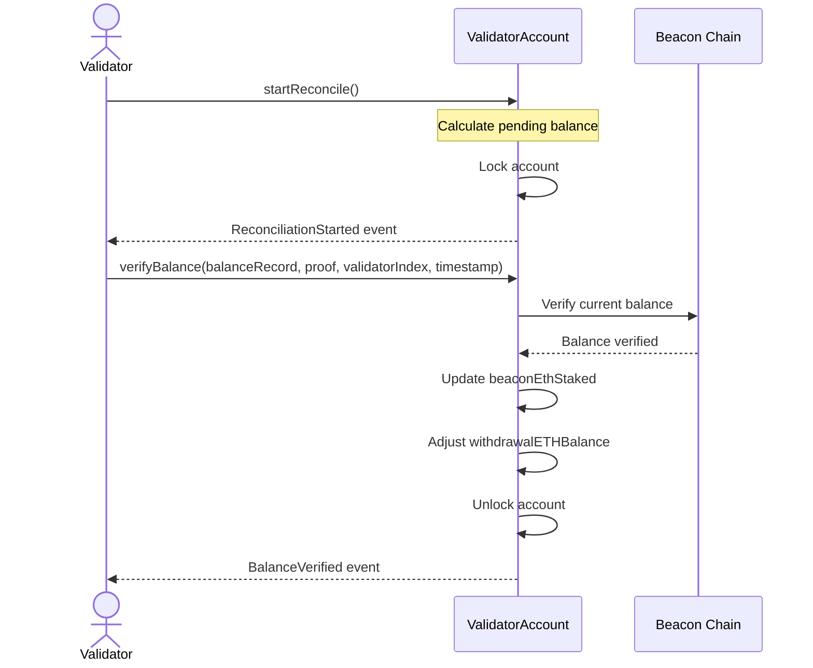

# Validator Setup

## Ethereum Validator Onboarding Documentation

### Overview

This document provides a comprehensive guide for onboarding an Ethereum validator to our platform. The platform enables unified validator management for both regular token staking and Beacon Chain validation, with additional features for participating in Actively Validated Services (AVS).

### System Architecture

### Validator Onboarding Process

The process of onboarding a validator involves several steps, from account deployment to verification and staking.

### Beacon Chain Verification

For validators operating on the Ethereum Beacon Chain, additional verification is required.

### Reconciliation Process

Beacon Chain validators need to periodically reconcile their on-chain balances.

### Key Functions

#### ValidatorAccount Functions

| Function                         | Purpose                                         |
| -------------------------------- | ----------------------------------------------- |
| `initialize`                     | Sets up the validator account with proper roles |
| `stakeToken`                     | Stakes ETH or ERC20 tokens                      |
| `withdrawToken`                  | Withdraws available tokens or rewards           |
| `unstakeToken`                   | Unstakes tokens after checking AVS enrollment   |
| `verifyWithdrawalAddress`        | Verifies and activates Beacon Chain validation  |
| `startReconcile`/`verifyBalance` | Handles Beacon Chain balance reconciliation     |
| `enroll`                         | Enrolls the validator in an AVS                 |
| `initiateDetach`/`executeDetach` | Handles AVS detachment with time lock           |
| `claimReward`                    | Claims rewards from validation activities       |

### Onboarding Checklist

1. **Preparation**:
   * Set up validator infrastructure
   * Generate Ethereum keys
2. **Account Creation**:
   * Call `deployValidatorAccount()` on StakeManager
   * Verify account creation and role assignments
3. **Staking**:
   * Stake ETH or ERC20 tokens via `stakeToken()`
   * For Beacon Chain: complete registration on Beacon Chain
   * Verify withdrawal address with `verifyWithdrawalAddress()`
4. **AVS Enrollment (Optional)**:
   * Research available AVS services
   * Enroll using `enroll()` with appropriate parameters
   * Monitor rewards and performance
5. **Maintenance**:
   * Regularly reconcile Beacon Chain balances
   * Claim rewards as necessary
   * Monitor for slashing events

### Troubleshooting

| Issue                 | Resolution                                         |
| --------------------- | -------------------------------------------------- |
| Unstaking failed      | Check AVS enrollment status                        |
| Verification failed   | Ensure validator data and proofs are correct       |
| Cannot withdraw       | Check if tokens are staked or slashed              |
| Reconciliation issues | Verify that pending balance matches expected value |

### Glossary

* **AVS**: Actively Validated Services - services that validators can provide
* **Beacon Chain**: Ethereum's proof-of-stake consensus layer
* **Reconciliation**: Process of verifying and updating Beacon Chain balances

***
