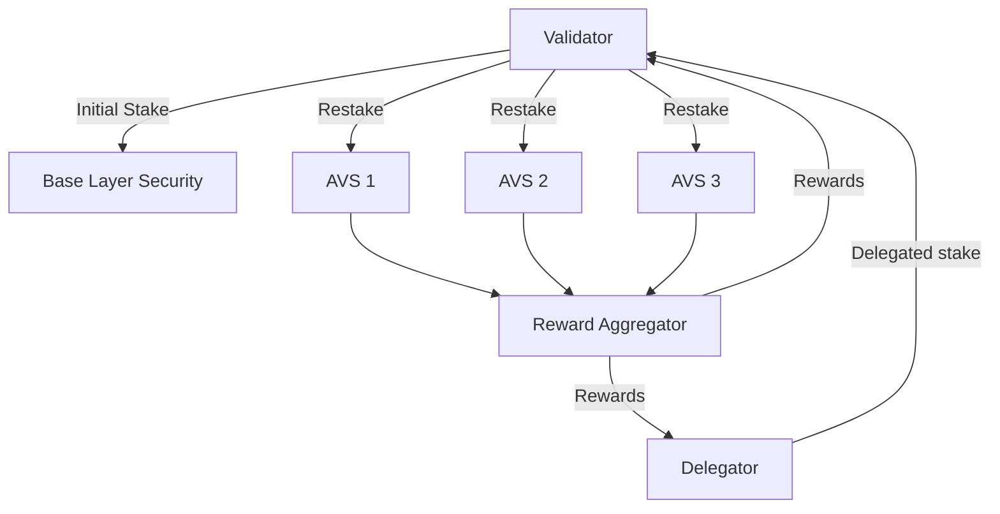

# Re²

## What is Re²?

Re² is the next step in restaking. We solve two major problems:

1. Restaking is still constrained to single chains, and many PoS chains do not have a restaking ecosystem. We unify access to economic security across ecosystems, allowing restaking participants to connect regardless of their chain of choice.
2. Restaking is a risky business. Proper risk analytics aren't widely available. We're building open-access tooling for all of our users.

## What is Restaking?

Restaking allows validators to reuse tokens staked on their base layer to secure other services at the same time. Unlike traditional staking, which limits stake utility to a single service, restaking enables validators to simultaneously secure multiple protocols and earn additional rewards.

## How Restaking Works

Restaking allows validators to earn additional rewards for providing economic security to additional services than just the base layer. These additional services (AVSs) provide rewards to their validators according to their work.

Delegators provide additional capital to validators, increasing their effective stake, and receiving a portion of the rewards in return.

## Getting Started

### For Validators

* [Validator Setup Guide](guides/validator-setup.md)

### For AVSs

* If you're looking to deploy an AVS, get in touch! We can often provide technical support to teams looking to build on ReSquared. DM us on X @Re\_Squared, or email us: team@re2.xyz
