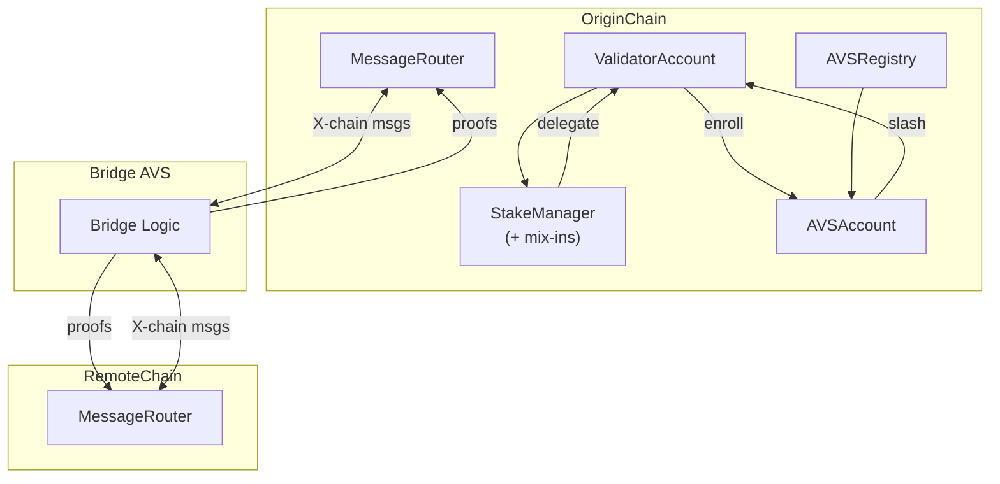

# Overview

## Architecture

### 1. Purpose

Enable **proof‑of‑stake validators across chains** to stake their capital _cross‑chain_ into modular **Actively‑Validated Services** (AVSs)—the in‑house bridge AVS included—while preserving cryptographic accountability and slashing guarantees.

### 2. Layer Cake

| Module                      | Core Contracts (upgradeability)                   | Sketch                                            |
| --------------------------- | ------------------------------------------------- | ------------------------------------------------- |
| **Accounts**                | `ValidatorAccount`, `AVSAccount`                  | Per‑entity escrows & action management            |
| **Delegations**             | `StakeManager`                                    | Delegation escrow & handling                      |
| **Registry**                | `AVSRegistry`                                     | Canonical AVS metadata; gate‑keeps enrolment.     |
| **Messaging AVS**           | `MessageRouter`                                   | Cross‑chain packet relay, run as an AVS.          |
| **Libraries & Proof Utils** | `BeaconUtils`, libs `BLS`, `Merkle*`, `Serialize` | On‑chain verification of beacon & message proofs. |

### 3. High‑Level Topology

_Restake_ and _AVS enrolment/detachment_ are origin‑chain L1 calls. All inter‑chain events propagate via the Bridge AVS.
